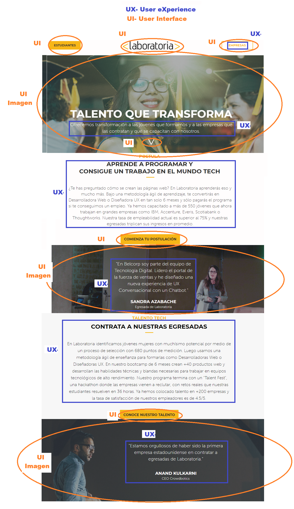
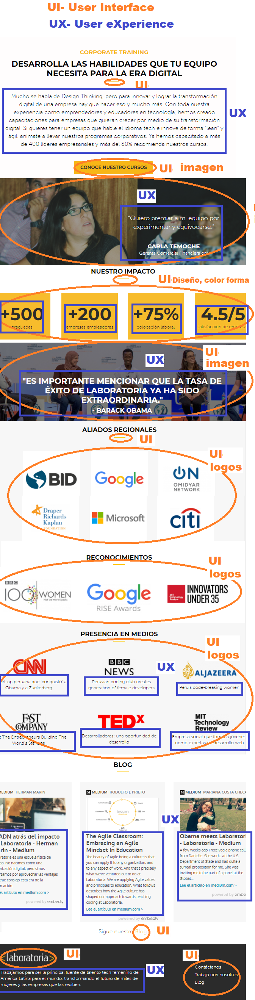
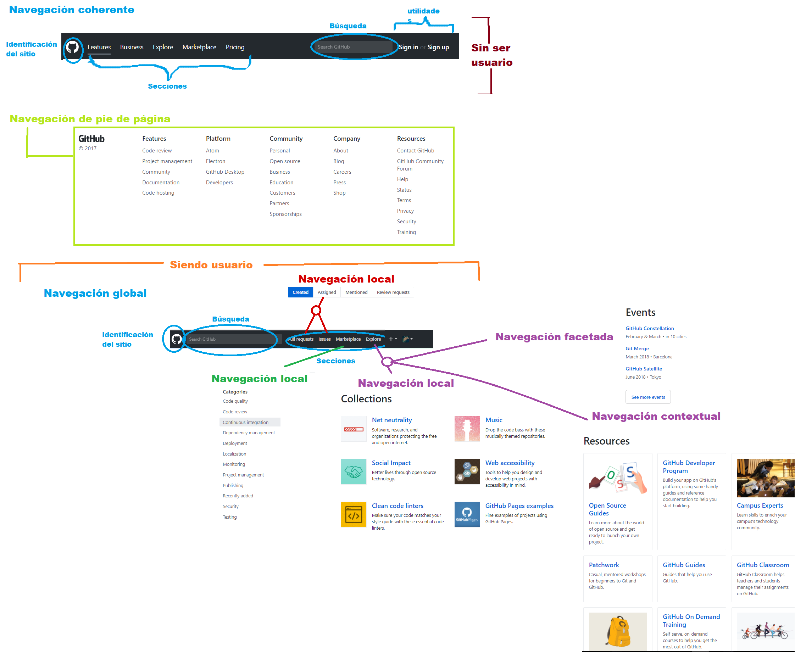

# Retos de UX.
### 1. A partir de la web de __Laboratoria__ explica qué partes conforman el UX y qué partes el UI.

> *UX* (por sus siglas en inglés **User eXperience**) o en español Experiencia de Usuario, es aquello que una persona percibe al interactuar con un producto o servicio. Se logra una buena UX cuando el enfoque es diseñar productos útiles, usables y deseables, lo cual influye en que el usuario se sienta satisfecho, feliz y encantado.
La persona que realiza UX, es conocida como un UX Designer y como parte de sus responsabilidades está el de investigar qué es lo que las personas necesitan para cumplir sus objetivos.
Dentro de las actividades que se realizan en UX, están:
* Investigación (con stakeholders, etnográfica, entrevistas 1 a 1…).
*	Pruebas (de usabilidad, con usuarios).
*	Experimentos (A/B, con prototipos).
*	Análisis de datos (KPI’s, métricas).
*	Arquitectura de información.

>*UI* (por sus siglas en inglés **User Interface**) o en español Interfaz del Usuario, es la vista que permite a un usuario interactuar de manera efectiva con un sistema. Es la suma de una arquitectura de información + elementos visuales + patrones de interacción.
Dentro de las actividades que se realizan en UI, están:
*	Diseño de interacción (cómo responde el sistema).
*	Guías de interacción (estados del sistema).
*	Diseño de elementos (botones, formularios).
*	Diseño visual (iconos, imágenes).
*	Guías de estilo (paletas de color, fonts).

>Fuente: [UXvsUI](http://blog.acantu.com/que-es-ux-y-ui/)

Partes que conforman UX y UI, parte A y parte B engloban el site de ___Laboratoria___ completo.

### 2. Identifica los elementos de navegación del site de __Github__.

A continuación se muestran los elementos de navegación del site de __Github__.

### 3. Crea un *sketch* para la herramienta del ***dashboard*** de __Laboratoria__.

>*Sketchear* o dibujar es una actividad muy común e importante dentro del proceso de diseño ya que permite identificar y establecer el flujo de un programa, así como la estructura de la información y los elementos gráficos necesarios para su buen desarrollo y funcionamiento.

El ***dashboard*** es una herramienta utilizada por profesores, training managers, directores y gerentes de Laboratoria para ver rápidamente qué está pasando en el salón de clases de Laboratoria. En el dashboard, los usuarios mencionados pueden ver rápidamente estadísticas y datos en tiempo real como:

* Número de alumnas inscritas.
* Número de alumnas que desertaron.
* Número y % de alumnas que pasan el criterio mínimo de evaluación.
* Promedio de notas por sprint.
* Promedio de notas HSE.
* Promedio de notas técnicas.

Además, dado que Laboratoria tiene muchas generaciones, regularmente 2 generaciones por año (estas generaciones empezaron en el 2014), y que opera en 4 sedes (Arequipa, Ciudad de México, Lima y Santiago de Chile), es posible que los usuarios quieran ver datos de sedes / generaciones anteriores para poder hacer comparaciones.
