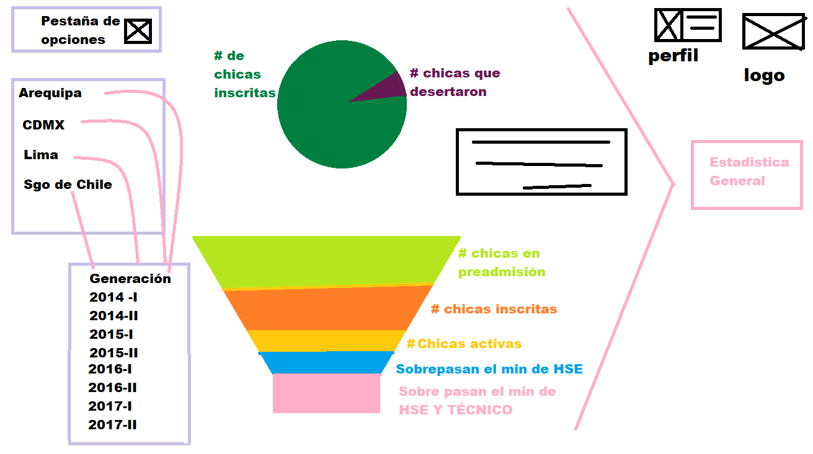

# Retos de UX.
### 1. A partir de la web de __Laboratoria__ explica qué partes conforman el UX y qué partes el UI.

> *UX* (por sus siglas en inglés **User eXperience**) o en español Experiencia de Usuario, es aquello que una persona percibe al interactuar con un producto o servicio. Se logra una buena UX cuando el enfoque es diseñar productos útiles, usables y deseables, lo cual influye en que el usuario se sienta satisfecho, feliz y encantado.
La persona que realiza UX, es conocida como un UX Designer y como parte de sus responsabilidades está el de investigar qué es lo que las personas necesitan para cumplir sus objetivos.
Dentro de las actividades que se realizan en UX, están:
* Investigación (con stakeholders, etnográfica, entrevistas 1 a 1…).
*	Pruebas (de usabilidad, con usuarios).
*	Experimentos (A/B, con prototipos).
*	Análisis de datos (KPI’s, métricas).
*	Arquitectura de información.

>*UI* (por sus siglas en inglés **User Interface**) o en español Interfaz del Usuario, es la vista que permite a un usuario interactuar de manera efectiva con un sistema. Es la suma de una arquitectura de información + elementos visuales + patrones de interacción.
Dentro de las actividades que se realizan en UI, están:
*	Diseño de interacción (cómo responde el sistema).
*	Guías de interacción (estados del sistema).
*	Diseño de elementos (botones, formularios).
*	Diseño visual (iconos, imágenes).
*	Guías de estilo (paletas de color, fonts).

>Fuente: [UXvsUI](http://blog.acantu.com/que-es-ux-y-ui/)

Partes que conforman UX y UI, parte A y parte B engloban el site de ___Laboratoria___ completo.

### 2. Identifica los elementos de navegación del site de __Github__.

A continuación se muestran los elementos de navegación del site de __Github__.

### 3. Crea un *sketch* para la herramienta del ***dashboard*** de __Laboratoria__.

>*Sketchear* o dibujar es una actividad muy común e importante dentro del proceso de diseño ya que permite identificar y establecer el flujo de un programa, así como la estructura de la información y los elementos gráficos necesarios para su buen desarrollo y funcionamiento.

El ***dashboard*** es una herramienta utilizada por profesores, training managers, directores y gerentes de Laboratoria para ver rápidamente qué está pasando en el salón de clases de Laboratoria. En el dashboard, los usuarios mencionados pueden ver rápidamente estadísticas y datos en tiempo real como:

* Número de alumnas inscritas.
* Número de alumnas que desertaron.
* Número y % de alumnas que pasan el criterio mínimo de evaluación.
* Promedio de notas por sprint.
* Promedio de notas HSE.
* Promedio de notas técnicas.

Además, dado que Laboratoria tiene muchas generaciones, regularmente 2 generaciones por año (estas generaciones empezaron en el 2014), y que opera en 4 sedes (Arequipa, Ciudad de México, Lima y Santiago de Chile), es posible que los usuarios quieran ver datos de sedes / generaciones anteriores para poder hacer comparaciones.

Para que se pueda visualizar los avances en las distintas generaciones y en las cuatro sedes en las que opera ___Laboratoria___  se ha diseñado el siguiente diagrama con los accesos necesarios:

En la anterior imagen se muestra la página principal del ***Dashboard*** en este se muestran dos gráficos el primero es tipo pastel y da a conocer cual es el número de deserción _general_ de Laboratoria, así como la cantidad de chicas que se han preparado conforme a lo esperado, es decir que han cumplido con el mínimo del promedio.
Para cada sede y generación se mostraran los mismos gráficos ya que en la página principal se mostraran los datos en gráficos pero de manera global.

## Explicación de cada gráfico mostrado.
1. En el gráfico siguente se muentran curvas de los promedios en Habilidades Socio Emocionales (HSE), retos de código terminados por las alumnas y el promedio de la evaluación técnica; esos tres elemntos en función de cada sprint.

También se puede notar una línea punteada, la cual indica el promedio de 90% que serian las chicas que han quedado exoneradas del pago mensual de $250.00 MXN, la línea sólida roja muestra el primedio de las chicas que han sobrepasado el promedio mínimo que __Laboratoria__ espera tener de sus alumnas.

2. En el gráfico siguiente se muestra un gráfico de barras en el que se muestra en # de alumnas que permanecen incritas desde el sprint 1 y se hace la comparativa con el número de alumnas que hayan ido desertando conforme avanza cada sprint.

El gráfico anterior es de gran utilidad para saber en que sprint hay más deserción, sabiendo el sprint de mayor deserción se puede visualizar en el gráfico del punto 1, en cual de las evaluaciones (el promedio de las chicas) batalla para promediar a una calificación mínima, es entonces donde se pueden tomar desiciones en la forma de evaluar o de la dificultad por sí sola del contenido.

## Sketch para una sede con distintas generaciones
Como se explico anteriormente para cada sede se visualizará el mismo diseño para expresar con datos lo que pasa en el salón de clases.
A continuación se muestra la infomación especificamente de la sede de Arequipa con sus respectivas generaciones.

